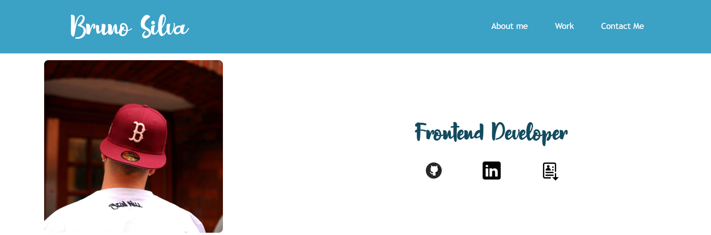

# Bruno Silva Portfolio

## The Repository

This repository is where I code my portfolio [Portfolio](https://github.com/blaztted/portfolio-bruno-silva/) in order to showcase my skills and projects to potential employers or clients.

## Portfolio

  

You can find the Portfolio [here](https://blaztted.github.io/portfolio-bruno-silva/).

## Diagram

  

## Links

https://github.com/blaztted/portfolio-bruno-silva/

https://blaztted.github.io/portfolio-bruno-silva/

## License

Copyright (c) Microsoft Corporation. All rights reserved.

Licensed under the [MIT](LICENSE.txt) license.
